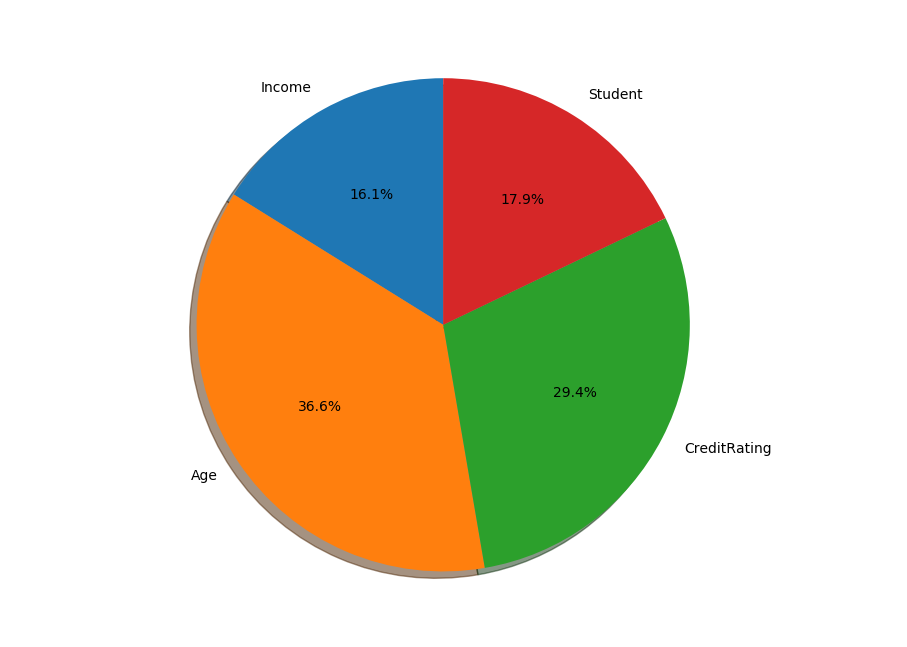

# Best-Feature-Identification


```

video data explanation

age 
1 for youth
2 for mid-age
3 for senior

Income 
1 for low
2 for medium 
3 for high

student 
1 for yes
2 for no

credit rating 
1 for fair
2 for excellent


buys computer
0 for no
1 for yes

```


```

This best feature is identified using dot data from classifier which is extracted using export graphviz
The best feature identified is shown in form of pie chart


```

 


```

Age is found to be most influencing feature to decide whether a person buys computer or not from the given csv data.


```
